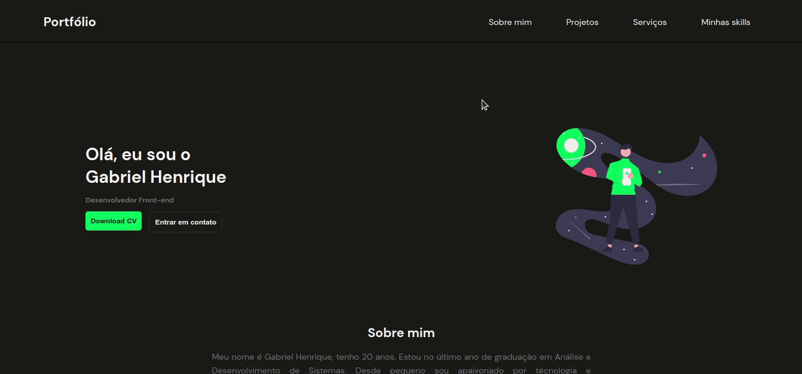

<h1 align="center">Portfolio 👦</h1>


<br></br>
<p align="justify">Meu portfolio pessoal.</p>


### :nut_and_bolt: Tecnologias

Esse projeto foi desenvolvido com as seguintes tecnologias:

- [Javascript][javascript]
- [TypeScript][typescript]
- [React][reactjs]
- [SASS][SASS]
- 
[Javascript]: https://developer.mozilla.org/pt-BR/docs/Web/JavaScript
[Typescript]: https://www.typescriptlang.org/
[Reactjs]: https://reactjs.org
[SASS]: https://sass-lang.com//

### 🤔 Como rodar o projeto? 

```bash
# Clone o repositório
git clone https://github.com/Gabriek0/portfolio

# Mude para o diretório do projeto
cd https://github.com/Gabriek0/portfolio

# Instale as dependências
npm

# Rode o projeto
npm run dev
```

### 🧑 Autor do Projeto

<table>
  <tr>
    <td align="center">
      <a href="https://github.com/Gabriek0">
        
        <br />
          <sub>
            <b>Gabriel Henrique</b>
          </sub>
      </a>
    </td>

  </tr>
</table>


